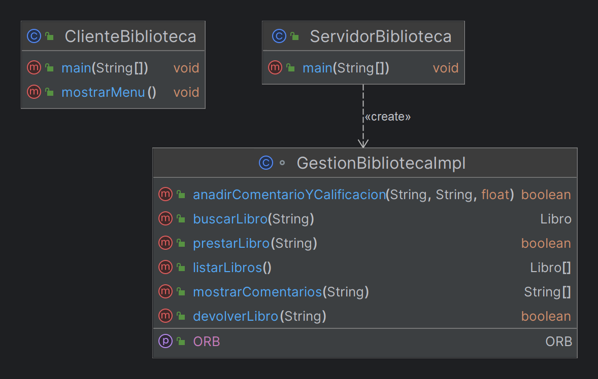

# Biblioteca en CORBA

## Autor

## Versiones Utilizadas

## Ejecución de la Práctica
Previamente, es necesario tener instalado el [JDK de Java](https://www.oracle.com/java/technologies/javase-jdk8-downloads.html) y el [IDE IntelliJ IDEA](https://www.jetbrains.com/idea/download/).

Para ejecutar la práctica, sigue los siguientes pasos:
1. Compila el fichero `.idl` con el comando: `idlj -fall Biblioteca.idl`.
2. Compila los ficheros `.java` con los comandos: `javac ServidorBiblioteca.java` y `javac ClienteBiblioteca.java` 
2. En una terminal, inicia el servicio de nombres ORB: `tnameserv -ORBInitialPort 1050`.
3. En otro terminal, ejecuta el servidor: `java ServidorBiblioteca -ORBInitialPort 1050 -ORBInitialHost localhost`.
4. En otro terminal, ejecuta el cliente: `java ClienteBiblioteca -ORBInitialPort 1050 -ORBInitialHost localhost`.

## Funcionalidades Añadidas
Se han implementado las siguientes funcionalidades:
- **Buscar Libro**: Busca un libro por título y devuelve los detalles si está disponible.
- **Prestar Libro**: Cambia el estado de un libro a no disponible.
- **Devolver Libro**: Cambia el estado de un libro a disponible.
- **Listar Libros**: Devuelve una lista de todos los libros en la biblioteca.
- **Añadir Comentario y Calificación**: Permite añadir un comentario y una calificación a un libro específico.
- **Mostrar Comentarios**: Muestra todos los comentarios asociados a un libro.

## Diagrama del Sistema

El diagrama de clases del sistema se muestra a continuación:

